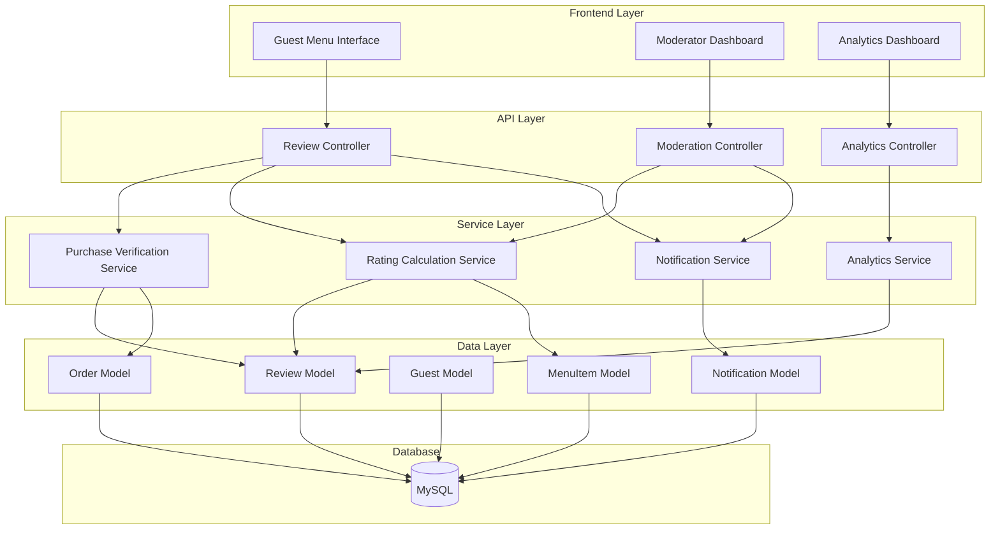
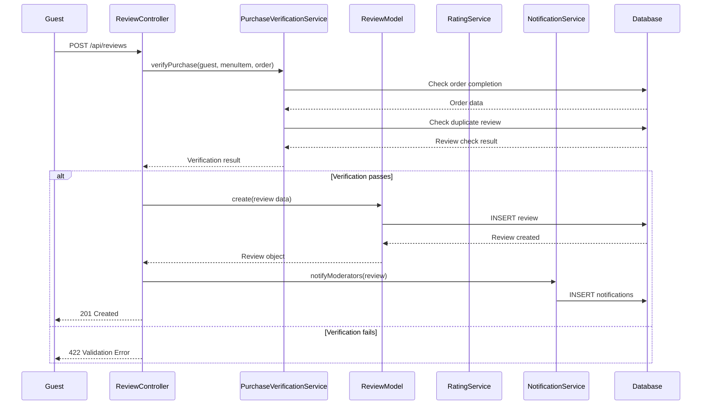
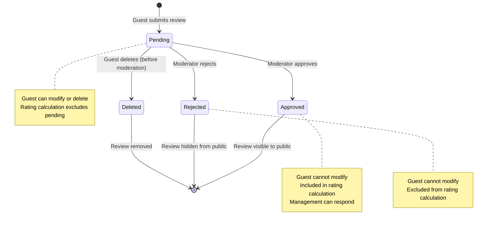
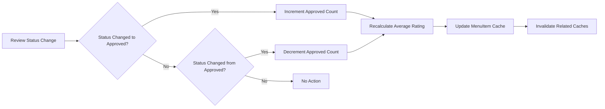

# Technical Design Document: Menu Item Review System

## Overview

This document provides a comprehensive technical design for implementing a verified-purchase menu item review and rating system within the Hotel Management System. The system ensures review authenticity by restricting review submissions to guests who have completed orders containing specific menu items. The design encompasses database schema, Laravel Eloquent models, RESTful API endpoints, business logic services, and security considerations.

### Core Principles

1. **Verified Purchase Integrity**: Only guests with completed orders containing specific menu items can review those items
2. **Moderation Workflow**: All reviews undergo approval before public display
3. **Privacy Protection**: Guest information is anonymized in public displays and on guest deletion
4. **Data Integrity**: Robust constraints prevent duplicate reviews and maintain referential integrity
5. **Scalability**: Efficient rating calculations with caching strategy for high-traffic scenarios

### Technology Stack

- **Backend Framework**: Laravel 10.x
- **Database**: MySQL 8.0+
- **Authentication**: Laravel Sanctum
- **Primary Keys**: UUIDs (using HasUuids trait)
- **API Style**: RESTful with JSON responses
- **Caching**: Laravel Cache (Redis recommended for production)

---

## Architecture

### System Components



### Request Flow Example: Review Submission



---

## Components and Interfaces

### Database Schema

#### menu_item_reviews Table

```sql
CREATE TABLE menu_item_reviews (
    id CHAR(36) PRIMARY KEY,
    guest_id CHAR(36) NOT NULL,
    order_id CHAR(36) NOT NULL,
    menu_item_id CHAR(36) NOT NULL,
    rating TINYINT UNSIGNED NOT NULL CHECK (rating BETWEEN 1 AND 5),
    review_text TEXT NULL,
    status ENUM('pending', 'approved', 'rejected') NOT NULL DEFAULT 'pending',
    approved_by CHAR(36) NULL,
    approved_at TIMESTAMP NULL,
    rejected_by CHAR(36) NULL,
    rejected_at TIMESTAMP NULL,
    helpful_count INT UNSIGNED NOT NULL DEFAULT 0,
    not_helpful_count INT UNSIGNED NOT NULL DEFAULT 0,
    created_at TIMESTAMP NOT NULL DEFAULT CURRENT_TIMESTAMP,
    updated_at TIMESTAMP NOT NULL DEFAULT CURRENT_TIMESTAMP ON UPDATE CURRENT_TIMESTAMP,
    deleted_at TIMESTAMP NULL,
    FOREIGN KEY (guest_id) REFERENCES guests(id) ON DELETE RESTRICT,
    FOREIGN KEY (order_id) REFERENCES orders(id) ON DELETE RESTRICT,
    FOREIGN KEY (menu_item_id) REFERENCES menu_items(id) ON DELETE CASCADE,
    FOREIGN KEY (approved_by) REFERENCES users(id) ON DELETE SET NULL,
    FOREIGN KEY (rejected_by) REFERENCES users(id) ON DELETE SET NULL,
    
    UNIQUE KEY unique_review_per_order (guest_id, order_id, menu_item_id),
    INDEX idx_menu_item_status (menu_item_id, status),
    INDEX idx_status_created (status, created_at),
    INDEX idx_guest_pending (guest_id, status)
) ENGINE=InnoDB DEFAULT CHARSET=utf8mb4 COLLATE=utf8mb4_unicode_ci;
```

#### review_responses Table

```sql
CREATE TABLE review_responses (
    id CHAR(36) PRIMARY KEY,
    review_id CHAR(36) NOT NULL,
    responder_id CHAR(36) NOT NULL,
    response_text VARCHAR(500) NOT NULL,
    created_at TIMESTAMP NOT NULL DEFAULT CURRENT_TIMESTAMP,
    updated_at TIMESTAMP NOT NULL DEFAULT CURRENT_TIMESTAMP ON UPDATE CURRENT_TIMESTAMP,
    
    FOREIGN KEY (review_id) REFERENCES menu_item_reviews(id) ON DELETE CASCADE,
    FOREIGN KEY (responder_id) REFERENCES users(id) ON DELETE SET NULL,
    
    UNIQUE KEY unique_response_per_review (review_id)
) ENGINE=InnoDB DEFAULT CHARSET=utf8mb4 COLLATE=utf8mb4_unicode_ci;
```

#### review_helpfulness_votes Table

```sql
CREATE TABLE review_helpfulness_votes (
    id CHAR(36) PRIMARY KEY,
    review_id CHAR(36) NOT NULL,
    guest_id CHAR(36) NULL,
    ip_address VARCHAR(45) NULL,
    vote_type ENUM('helpful', 'not_helpful') NOT NULL,
    created_at TIMESTAMP NOT NULL DEFAULT CURRENT_TIMESTAMP,
    
    FOREIGN KEY (review_id) REFERENCES menu_item_reviews(id) ON DELETE CASCADE,
    FOREIGN KEY (guest_id) REFERENCES guests(id) ON DELETE SET NULL,
    
    UNIQUE KEY unique_guest_vote (review_id, guest_id),
    UNIQUE KEY unique_ip_vote (review_id, ip_address),
    INDEX idx_review_votes (review_id, vote_type)
) ENGINE=InnoDB DEFAULT CHARSET=utf8mb4 COLLATE=utf8mb4_unicode_ci;
```

#### review_notifications Table

```sql
CREATE TABLE review_notifications (
    id CHAR(36) PRIMARY KEY,
    user_id CHAR(36) NOT NULL,
    review_id CHAR(36) NOT NULL,
    notification_type ENUM('new_review', 'review_approved', 'review_rejected') NOT NULL,
    message TEXT NOT NULL,
    is_read BOOLEAN NOT NULL DEFAULT FALSE,
    created_at TIMESTAMP NOT NULL DEFAULT CURRENT_TIMESTAMP,
    read_at TIMESTAMP NULL,
    
    FOREIGN KEY (user_id) REFERENCES users(id) ON DELETE CASCADE,
    FOREIGN KEY (review_id) REFERENCES menu_item_reviews(id) ON DELETE CASCADE,
    
    INDEX idx_user_unread (user_id, is_read, created_at)
) ENGINE=InnoDB DEFAULT CHARSET=utf8mb4 COLLATE=utf8mb4_unicode_ci;
```

### Laravel Migration Files

#### Create Menu Item Reviews Table

```php
<?php

use Illuminate\Database\Migrations\Migration;
use Illuminate\Database\Schema\Blueprint;
use Illuminate\Support\Facades\Schema;

return new class extends Migration
{
    public function up(): void
    {
        Schema::create('menu_item_reviews', function (Blueprint $table) {
            $table->uuid('id')->primary();
            $table->uuid('guest_id');
            $table->uuid('order_id');
            $table->uuid('menu_item_id');
            $table->unsignedTinyInteger('rating');
            $table->text('review_text')->nullable();
            $table->enum('status', ['pending', 'approved', 'rejected'])->default('pending');
            $table->uuid('approved_by')->nullable();
            $table->timestamp('approved_at')->nullable();
            $table->uuid('rejected_by')->nullable();
            $table->timestamp('rejected_at')->nullable();
            $table->unsignedInteger('helpful_count')->default(0);
            $table->unsignedInteger('not_helpful_count')->default(0);
            $table->timestamps();
            $table->softDeletes();
            
            // Foreign keys
            $table->foreign('guest_id')->references('id')->on('guests')->onDelete('restrict');
            $table->foreign('order_id')->references('id')->on('orders')->onDelete('restrict');
            $table->foreign('menu_item_id')->references('id')->on('menu_items')->onDelete('cascade');
            $table->foreign('approved_by')->references('id')->on('users')->onDelete('set null');
            $table->foreign('rejected_by')->references('id')->on('users')->onDelete('set null');
            
            // Unique constraint
            $table->unique(['guest_id', 'order_id', 'menu_item_id'], 'unique_review_per_order');
            
            // Indexes
            $table->index(['menu_item_id', 'status'], 'idx_menu_item_status');
            $table->index(['status', 'created_at'], 'idx_status_created');
            $table->index(['guest_id', 'status'], 'idx_guest_pending');
            
            // Check constraint for rating
            $table->check('rating >= 1 AND rating <= 5');
        });
    }

    public function down(): void
    {
        Schema::dropIfExists('menu_item_reviews');
    }
};
```

#### Create Review Responses Table

```php
<?php

use Illuminate\Database\Migrations\Migration;
use Illuminate\Database\Schema\Blueprint;
use Illuminate\Support\Facades\Schema;

return new class extends Migration
{
    public function up(): void
    {
        Schema::create('review_responses', function (Blueprint $table) {
            $table->uuid('id')->primary();
            $table->uuid('review_id');
            $table->uuid('responder_id');
            $table->string('response_text', 500);
            $table->timestamps();
            
            $table->foreign('review_id')->references('id')->on('menu_item_reviews')->onDelete('cascade');
            $table->foreign('responder_id')->references('id')->on('users')->onDelete('set null');
            
            $table->unique('review_id', 'unique_response_per_review');
        });
    }

    public function down(): void
    {
        Schema::dropIfExists('review_responses');
    }
};
```

#### Create Review Helpfulness Votes Table

```php
<?php

use Illuminate\Database\Migrations\Migration;
use Illuminate\Database\Schema\Blueprint;
use Illuminate\Support\Facades\Schema;

return new class extends Migration
{
    public function up(): void
    {
        Schema::create('review_helpfulness_votes', function (Blueprint $table) {
            $table->uuid('id')->primary();
            $table->uuid('review_id');
            $table->uuid('guest_id')->nullable();
            $table->string('ip_address', 45)->nullable();
            $table->enum('vote_type', ['helpful', 'not_helpful']);
            $table->timestamp('created_at')->useCurrent();
            
            $table->foreign('review_id')->references('id')->on('menu_item_reviews')->onDelete('cascade');
            $table->foreign('guest_id')->references('id')->on('guests')->onDelete('set null');
            
            $table->unique(['review_id', 'guest_id'], 'unique_guest_vote');
            $table->unique(['review_id', 'ip_address'], 'unique_ip_vote');
            $table->index(['review_id', 'vote_type'], 'idx_review_votes');
        });
    }

    public function down(): void
    {
        Schema::dropIfExists('review_helpfulness_votes');
    }
};
```

#### Create Review Notifications Table

```php
<?php

use Illuminate\Database\Migrations\Migration;
use Illuminate\Database\Schema\Blueprint;
use Illuminate\Support\Facades\Schema;

return new class extends Migration
{
    public function up(): void
    {
        Schema::create('review_notifications', function (Blueprint $table) {
            $table->uuid('id')->primary();
            $table->uuid('user_id');
            $table->uuid('review_id');
            $table->enum('notification_type', ['new_review', 'review_approved', 'review_rejected']);
            $table->text('message');
            $table->boolean('is_read')->default(false);
            $table->timestamp('created_at')->useCurrent();
            $table->timestamp('read_at')->nullable();
            
            $table->foreign('user_id')->references('id')->on('users')->onDelete('cascade');
            $table->foreign('review_id')->references('id')->on('menu_item_reviews')->onDelete('cascade');
            
            $table->index(['user_id', 'is_read', 'created_at'], 'idx_user_unread');
        });
    }

    public function down(): void
    {
        Schema::dropIfExists('review_notifications');
    }
};
```

### Eloquent Models

#### MenuItemReview Model

```php
<?php

namespace App\Models;

use Illuminate\Database\Eloquent\Model;
use Illuminate\Database\Eloquent\Factories\HasFactory;
use Illuminate\Database\Eloquent\Concerns\HasUuids;
use Illuminate\Database\Eloquent\SoftDeletes;

class MenuItemReview extends Model
{
    use HasFactory, HasUuids, SoftDeletes;

    protected $table = 'menu_item_reviews';
    public $incrementing = false;
    protected $keyType = 'string';

    protected $fillable = [
        'guest_id',
        'order_id',
        'menu_item_id',
        'rating',
        'review_text',
        'status',
        'approved_by',
        'approved_at',
        'rejected_by',
        'rejected_at',
        'helpful_count',
        'not_helpful_count',
    ];

    protected $casts = [
        'rating' => 'integer',
        'helpful_count' => 'integer',
        'not_helpful_count' => 'integer',
        'approved_at' => 'datetime',
        'rejected_at' => 'datetime',
        'created_at' => 'datetime',
        'updated_at' => 'datetime',
    ];

    /*
    |--------------------------------------------------------------------------
    | Status Constants
    |--------------------------------------------------------------------------
    */

    public const STATUS_PENDING = 'pending';
    public const STATUS_APPROVED = 'approved';
    public const STATUS_REJECTED = 'rejected';

    /*
    |--------------------------------------------------------------------------
    | Relationships
    |--------------------------------------------------------------------------
    */

    public function guest()
    {
        return $this->belongsTo(Guest::class);
    }

    public function order()
    {
        return $this->belongsTo(Order::class);
    }

    public function menuItem()
    {
        return $this->belongsTo(MenuItem::class);
    }

    public function approver()
    {
        return $this->belongsTo(User::class, 'approved_by');
    }

    public function rejecter()
    {
        return $this->belongsTo(User::class, 'rejected_by');
    }

    public function response()
    {
        return $this->hasOne(ReviewResponse::class, 'review_id');
    }

    public function votes()
    {
        return $this->hasMany(ReviewHelpfulnessVote::class, 'review_id');
    }

    public function notifications()
    {
        return $this->hasMany(ReviewNotification::class, 'review_id');
    }

    /*
    |--------------------------------------------------------------------------
    | Query Scopes
    |--------------------------------------------------------------------------
    */

    public function scopePending($query)
    {
        return $query->where('status', self::STATUS_PENDING);
    }

    public function scopeApproved($query)
    {
        return $query->where('status', self::STATUS_APPROVED);
    }

    public function scopeRejected($query)
    {
        return $query->where('status', self::STATUS_REJECTED);
    }

    public function scopeForMenuItem($query, string $menuItemId)
    {
        return $query->where('menu_item_id', $menuItemId);
    }

    public function scopeByGuest($query, string $guestId)
    {
        return $query->where('guest_id', $guestId);
    }

    public function scopeRecentFirst($query)
    {
        return $query->orderBy('created_at', 'desc');
    }

    public function scopeByHelpfulness($query)
    {
        return $query->orderByRaw('helpful_count / (helpful_count + not_helpful_count + 1) DESC');
    }

    /*
    |--------------------------------------------------------------------------
    | Status Helper Methods
    |--------------------------------------------------------------------------
    */

    public function isPending(): bool
    {
        return $this->status === self::STATUS_PENDING;
    }

    public function isApproved(): bool
    {
        return $this->status === self::STATUS_APPROVED;
    }

    public function isRejected(): bool
    {
        return $this->status === self::STATUS_REJECTED;
    }
    public function canBeModifiedByGuest(): bool
    {
        return $this->isPending();
    }
    public function getAnonymizedGuestNameAttribute(): string
    {
        if (!$this->guest) {
            return 'Anonymous Guest';
        }
        
        $lastName = $this->guest->last_name ? strtoupper(substr($this->guest->last_name, 0, 1)) . '.' : '';
        return trim($this->guest->first_name . ' ' . $lastName);
    }

    public function getHelpfulnessRatioAttribute(): float
    {
        $total = $this->helpful_count + $this->not_helpful_count;
        return $total > 0 ? round($this->helpful_count / $total, 2) : 0;
    }

    public function getPublicDisplayDataAttribute(): array
    {
        return [
            'id' => $this->id,
            'guest_name' => $this->anonymized_guest_name,
            'rating' => $this->rating,
            'review_text' => $this->review_text,
            'helpful_count' => $this->helpful_count,
            'not_helpful_count' => $this->not_helpful_count,
            'helpfulness_ratio' => $this->helpfulness_ratio,
            'created_at' => $this->created_at->toIso8601String(),
            'response' => $this->response ? [
                'text' => $this->response->response_text,
                'responder_role' => $this->response->responder->role ?? 'Manager',
                'created_at' => $this->response->created_at->toIso8601String(),
            ] : null,
        ];
    }
}
```

#### ReviewResponse Model

```php
<?php

namespace App\Models;

use Illuminate\Database\Eloquent\Model;
use Illuminate\Database\Eloquent\Factories\HasFactory;
use Illuminate\Database\Eloquent\Concerns\HasUuids;

class ReviewResponse extends Model
{
    use HasFactory, HasUuids;

    protected $table = 'review_responses';
    public $incrementing = false;
    protected $keyType = 'string';

    protected $fillable = [
        'review_id',
        'responder_id',
        'response_text',
    ];

    protected $casts = [
        'created_at' => 'datetime',
        'updated_at' => 'datetime',
    ];

    /*
    |--------------------------------------------------------------------------
    | Relationships
    |--------------------------------------------------------------------------
    */

    public function review()
    {
        return $this->belongsTo(MenuItemReview::class, 'review_id');
    }

    public function responder()
    {
        return $this->belongsTo(User::class, 'responder_id');
    }
}
```

#### ReviewHelpfulnessVote Model

```php
<?php

namespace App\Models;

use Illuminate\Database\Eloquent\Model;
use Illuminate\Database\Eloquent\Factories\HasFactory;
use Illuminate\Database\Eloquent\Concerns\HasUuids;

class ReviewHelpfulnessVote extends Model
{
    use HasFactory, HasUuids;

    protected $table = 'review_helpfulness_votes';
    public $incrementing = false;
    protected $keyType = 'string';
    public $timestamps = false;

    protected $fillable = [
        'review_id',
        'guest_id',
        'ip_address',
        'vote_type',
    ];

    protected $casts = [
        'created_at' => 'datetime',
    ];
    public const VOTE_HELPFUL = 'helpful';
    public const VOTE_NOT_HELPFUL = 'not_helpful';

    /*
    |--------------------------------------------------------------------------
    | Relationships
    |--------------------------------------------------------------------------
    */

    public function review()
    {
        return $this->belongsTo(MenuItemReview::class, 'review_id');
    }

    public function guest()
    {
        return $this->belongsTo(Guest::class);
    }
}
```

#### ReviewNotification Model

```php
<?php

namespace App\Models;

use Illuminate\Database\Eloquent\Model;
use Illuminate\Database\Eloquent\Factories\HasFactory;
use Illuminate\Database\Eloquent\Concerns\HasUuids;

class ReviewNotification extends Model
{
    use HasFactory, HasUuids;

    protected $table = 'review_notifications';
    public $incrementing = false;
    protected $keyType = 'string';
    public $timestamps = false;

    protected $fillable = [
        'user_id',
        'review_id',
        'notification_type',
        'message',
        'is_read',
        'read_at',
    ];

    protected $casts = [
        'is_read' => 'boolean',
        'created_at' => 'datetime',
        'read_at' => 'datetime',
    ];

    /*
    |--------------------------------------------------------------------------
    | Notification Type Constants
    |--------------------------------------------------------------------------
    */

    public const TYPE_NEW_REVIEW = 'new_review';
    public const TYPE_REVIEW_APPROVED = 'review_approved';
    public const TYPE_REVIEW_REJECTED = 'review_rejected';

    /*
    |--------------------------------------------------------------------------
    | Relationships
    |--------------------------------------------------------------------------
    */

    public function user()
    {
        return $this->belongsTo(User::class);
    }

    public function review()
    {
        return $this->belongsTo(MenuItemReview::class, 'review_id');
    }

    /*
    |--------------------------------------------------------------------------
    | Query Scopes
    |--------------------------------------------------------------------------
    */

    public function scopeUnread($query)
    {
        return $query->where('is_read', false);
    }

    public function scopeForUser($query, string $userId)
    {
        return $query->where('user_id', $userId);
    }

    /*
    |--------------------------------------------------------------------------
    | Helper Methods
    |--------------------------------------------------------------------------
    */

    public function markAsRead(): void
    {
        $this->update([
            'is_read' => true,
            'read_at' => now(),
        ]);
    }
}
```

### Model Relationship Extensions
#### MenuItem Model Extension

Add these methods to the existing `MenuItem` model:

```php
/**
 * Menu item has many reviews
 */
public function reviews()
{
    return $this->hasMany(MenuItemReview::class, 'menu_item_id');
}

/**
 * Get only approved reviews
 */
public function approvedReviews()
{
    return $this->reviews()->approved();
}

/**
 * Get average rating
 */
public function getAverageRatingAttribute(): ?float
{
    $avg = $this->approvedReviews()->avg('rating');
    return $avg ? round($avg, 1) : null;
}

/**
 * Get review count
 */
public function getReviewCountAttribute(): int
{
    return $this->approvedReviews()->count();
}

/**
 * Get rating distribution
 */
public function getRatingDistributionAttribute(): array
{
    $distribution = [];
    for ($i = 1; $i <= 5; $i++) {
        $distribution[$i] = $this->approvedReviews()->where('rating', $i)->count();
    }
    return $distribution;
}
```

#### Guest Model Extension

Add these methods to the existing `Guest` model:

```php
/**
 * Guest has many reviews
 */
public function reviews()
{
    return $this->hasMany(MenuItemReview::class, 'guest_id');
}

/**
 * Get eligible menu items for review
 */
public function getEligibleMenuItemsForReview()
{
    return MenuItem::whereHas('orderItems.order', function ($query) {
        $query->where('guest_id', $this->id)
              ->whereIn('status', [Order::STATUS_SERVED, 'completed']);
    })
    ->whereDoesntHave('reviews', function ($query) {
        $query->where('guest_id', $this->id);
    })
    ->with(['orderItems.order' => function ($query) {
        $query->where('guest_id', $this->id)
              ->whereIn('status', [Order::STATUS_SERVED, 'completed']);
    }])
    ->get();
}

/**
 * Check if guest can review a specific menu item from an order
 */
public function canReviewMenuItem(string $menuItemId, string $orderId): bool
{
    // Check if order exists and is completed
    $order = Order::where('id', $orderId)
        ->where('guest_id', $this->id)
        ->whereIn('status', [Order::STATUS_SERVED, 'completed'])
        ->first();
    
    if (!$order) {
        return false;
    }
    
    // Check if order contains the menu item
    $hasMenuItem = $order->orderItems()->where('menu_item_id', $menuItemId)->exists();
    
    if (!$hasMenuItem) {
        return false;
    }
    
    // Check if review already exists
    $reviewExists = MenuItemReview::where('guest_id', $this->id)
        ->where('order_id', $orderId)
        ->where('menu_item_id', $menuItemId)
        ->exists();
    
    return !$reviewExists;
}
```

#### Order Model Extension

Add these methods to the existing `Order` model:

```php
/**
 * Order has many reviews
 */
public function reviews()
{
    return $this->hasMany(MenuItemReview::class, 'order_id');
}

/**
 * Check if order is completed
 */
public function isCompleted(): bool
{
    return in_array($this->status, [self::STATUS_SERVED, 'completed']);
}

/**
 * Get reviewable items from this order
 */
public function getReviewableItemsAttribute()
{
    if (!$this->isCompleted()) {
        return collect([]);
    }
    
    return $this->orderItems()
        ->with('menuItem')
        ->whereDoesntHave('menuItem.reviews', function ($query) {
            $query->where('guest_id', $this->guest_id)
                  ->where('order_id', $this->id);
        })
        ->get()
        ->pluck('menuItem');
}
```

---

## Data Models

### Review Lifecycle State Machine



### Rating Calculation Data Flow



---

## Correctness Properties

*A property is a characteristic or behavior that should hold true across all valid executions of a system—essentially, a formal statement about what the system should do. Properties serve as the bridge between human-readable specifications and machine-verifiable correctness guarantees.*

### Property 1: Purchase Verification Invariant

*For any* review submission, the system SHALL accept the review if and only if there exists a completed order (status 'served' or 'completed') belonging to the submitting guest that contains the menu item being reviewed, AND no duplicate review exists for that guest-order-menu item combination.

**Validates: Requirements 1.1, 1.2, 1.6, 1.7, 1.8**

### Property 2: Review Status Transition Constraints

*For any* review, if the review status is 'approved' or 'rejected', then no guest modifications (rating or text updates) SHALL be permitted, and any attempt SHALL result in an error response.

**Validates: Requirements 4.3**

### Property 3: Rating Calculation Consistency

*For any* menu item, the average rating SHALL equal the arithmetic mean of all approved review ratings for that menu item, rounded to one decimal place, and the review count SHALL equal the total number of approved reviews.

**Validates: Requirements 3.1, 3.2, 3.4**

### Property 4: Guest Anonymization on Deletion

*For any* approved review, if the associated guest record is deleted, then the guest name SHALL be replaced with 'Anonymous Guest' in all public displays, while the review itself SHALL remain visible.

**Validates: Requirements 7.5**

### Property 5: Helpfulness Vote Uniqueness

*For any* review and guest combination, the system SHALL accept at most one helpfulness vote (either 'helpful' OR 'not_helpful'), and subsequent vote attempts from the same guest SHALL be rejected with an error.

**Validates: Requirements 10.3, 10.4**

### Property 6: Notification Creation Completeness

*For any* new review submission, the system SHALL create notifications for all users with 'manager' or 'admin' roles, and when a review is moderated (approved or rejected), a notification SHALL be created for the guest who submitted it.

**Validates: Requirements 8.1, 8.3**

### Property 7: Moderation Status Update Atomicity

*For any* review status change from 'pending' to 'approved', the system SHALL atomically update the review status, record the moderator ID, set the approval timestamp, AND trigger average rating recalculation for the associated menu item.

**Validates: Requirements 2.2, 2.7**

### Property 8: Review Response Uniqueness

*For any* review, the system SHALL allow at most one management response, and subsequent response creation attempts SHALL fail while update operations SHALL replace the existing response.

**Validates: Requirements 9.4, 9.5**

### Property 9: Duplicate Review Prevention

*For any* guest, order, and menu item combination, the system SHALL enforce uniqueness such that at most one review can exist, regardless of review status (pending, approved, or rejected).

**Validates: Requirements 1.2, 1.7, 7.1**

### Property 10: Rating Value Constraints

*For any* review submission or update, the rating value SHALL be an integer between 1 and 5 inclusive, and any value outside this range SHALL be rejected at both application and database levels.

**Validates: Requirements 1.4, 4.6, 7.7**

### Property 11: Review Text Sanitization

*For any* review submission or update, the review text SHALL be validated to exclude HTML tags and script elements, preventing XSS attacks while preserving legitimate text content.

**Validates: Requirements 7.8**

### Property 12: Order Deletion Constraint

*For any* order, if approved reviews exist that reference this order, then order deletion SHALL be prevented and an error SHALL be returned; orders without approved reviews MAY be deleted.

**Validates: Requirements 7.3**

---

## Error Handling

### Error Response Format

All API errors follow a consistent JSON structure:

```json
{
    "error": "Brief error identifier",
    "message": "Human-readable error message",
    "errors": {
        "field_name": ["Validation error message"]
    },
    "status": 422
}
```

### HTTP Status Codes

| Status Code | Usage |
|-------------|-------|
| 200 OK | Successful GET, PUT, PATCH requests |
| 201 Created | Successful POST requests creating a resource |
| 204 No Content | Successful DELETE requests |
| 400 Bad Request | Malformed request syntax |
| 401 Unauthorized | Missing or invalid authentication |
| 403 Forbidden | Valid authentication but insufficient permissions |
| 404 Not Found | Resource does not exist |
| 422 Unprocessable Entity | Validation errors or business logic violations |
| 429 Too Many Requests | Rate limiting exceeded |
| 500 Internal Server Error | Unexpected server errors |

### Business Logic Errors

#### Purchase Verification Errors

```php
// No completed order with menu item
return response()->json([
    'error' => 'Purchase not verified',
    'message' => 'You must order this item before reviewing it',
], 422);

// Order not completed
return response()->json([
    'error' => 'Order not completed',
    'message' => 'You can only review items from completed orders',
], 422);

// Duplicate review
return response()->json([
    'error' => 'Duplicate review',
    'message' => 'You have already reviewed this item for this order',
], 422);
```

#### Modification Errors

```php
// Attempt to modify approved/rejected review
return response()->json([
    'error' => 'Modification forbidden',
    'message' => 'Cannot modify a moderated review',
], 422);

// Unauthorized modification attempt
return response()->json([
    'error' => 'Unauthorized',
    'message' => 'Unauthorized access',
], 403);
```

#### Voting Errors

```php
// Duplicate vote attempt
return response()->json([
    'error' => 'Duplicate vote',
    'message' => 'You have already voted on this review',
], 422);
```

### Exception Handling Strategy

#### Service Layer

Services throw domain-specific exceptions:

```php
namespace App\Exceptions;

class PurchaseNotVerifiedException extends \Exception {}
class DuplicateReviewException extends \Exception {}
class ReviewNotModifiableException extends \Exception {}
class UnauthorizedReviewAccessException extends \Exception {}
class DuplicateVoteException extends \Exception {}
```

#### Controller Layer

Controllers catch service exceptions and return appropriate HTTP responses:

```php
try {
    $review = $this->reviewService->createReview($data);
    return response()->json(['data' => $review], 201);
} catch (PurchaseNotVerifiedException $e) {
    return response()->json([
        'error' => 'Purchase not verified',
        'message' => $e->getMessage()
    ], 422);
} catch (DuplicateReviewException $e) {
    return response()->json([
        'error' => 'Duplicate review',
        'message' => $e->getMessage()
    ], 422);
} catch (\Exception $e) {
    Log::error('Review creation failed', [
        'error' => $e->getMessage(),
        'trace' => $e->getTraceAsString()
    ]);
    return response()->json([
        'error' => 'Server error',
        'message' => 'Unable to create review'
    ], 500);
}
```

---

## Testing Strategy

### Testing Approach

The review system requires a dual testing approach:

1. **Unit Tests**: Verify specific examples, edge cases, and error conditions
2. **Integration Tests**: Verify interactions between components and database integrity
3. **Property-Based Tests**: NOT applicable for this feature (see rationale below)

### Why Property-Based Testing Is NOT Appropriate

This feature is **NOT suitable for property-based testing** because:

1. **Infrastructure and External Dependencies**: The system heavily relies on database constraints, foreign keys, and Laravel's ORM behavior
2. **CRUD Operations**: Core functionality involves database reads/writes with minimal transformation logic
3. **Complex State Management**: Review lifecycle depends on order status, guest authentication, and moderation workflow - not pure functions
4. **Side Effects**: Notification creation, cache invalidation, and database transactions are side-effect operations

**Alternative Testing Strategy**: Use example-based unit tests for business logic, integration tests for database interactions, and end-to-end tests for complete workflows.

### Unit Testing Coverage

#### ReviewService Tests

```php
namespace Tests\Unit\Services;

use Tests\TestCase;
use App\Services\ReviewService;
use App\Exceptions\PurchaseNotVerifiedException;
use Illuminate\Foundation\Testing\RefreshDatabase;

class ReviewServiceTest extends TestCase
{
    use RefreshDatabase;

    /** @test */
    public function it_rejects_review_when_guest_has_not_ordered_item()
    {
        $this->expectException(PurchaseNotVerifiedException::class);
        $this->expectExceptionMessage('You must order this item before reviewing it');

        $guest = Guest::factory()->create();
        $menuItem = MenuItem::factory()->create();
        
        $service = app(ReviewService::class);
        $service->createReview([
            'guest_id' => $guest->id,
            'order_id' => Str::uuid(),
            'menu_item_id' => $menuItem->id,
            'rating' => 5,
        ]);
    }

    /** @test */
    public function it_rejects_review_when_order_is_not_completed()
    {
        $this->expectException(PurchaseNotVerifiedException::class);
        $this->expectExceptionMessage('You can only review items from completed orders');

        $guest = Guest::factory()->create();
        $menuItem = MenuItem::factory()->create();
        $order = Order::factory()->create([
            'guest_id' => $guest->id,
            'status' => 'pending', // Not completed
        ]);
        
        OrderItem::factory()->create([
            'order_id' => $order->id,
            'menu_item_id' => $menuItem->id,
        ]);

        $service = app(ReviewService::class);
        $service->createReview([
            'guest_id' => $guest->id,
            'order_id' => $order->id,
            'menu_item_id' => $menuItem->id,
            'rating' => 5,
        ]);
    }

    /** @test */
    public function it_accepts_review_when_order_is_served()
    {
        $guest = Guest::factory()->create();
        $menuItem = MenuItem::factory()->create();
        $order = Order::factory()->create([
            'guest_id' => $guest->id,
            'status' => Order::STATUS_SERVED,
        ]);
        
        OrderItem::factory()->create([
            'order_id' => $order->id,
            'menu_item_id' => $menuItem->id,
        ]);

        $service = app(ReviewService::class);
        $review = $service->createReview([
            'guest_id' => $guest->id,
            'order_id' => $order->id,
            'menu_item_id' => $menuItem->id,
            'rating' => 5,
            'review_text' => 'Excellent!',
        ]);

        $this->assertDatabaseHas('menu_item_reviews', [
            'id' => $review->id,
            'status' => 'pending',
        ]);
    }

    /** @test */
    public function it_rejects_duplicate_review_for_same_order()
    {
        $this->expectException(DuplicateReviewException::class);

        $guest = Guest::factory()->create();
        $menuItem = MenuItem::factory()->create();
        $order = Order::factory()->create([
            'guest_id' => $guest->id,
            'status' => Order::STATUS_SERVED,
        ]);
        
        OrderItem::factory()->create([
            'order_id' => $order->id,
            'menu_item_id' => $menuItem->id,
        ]);

        // Create first review
        MenuItemReview::factory()->create([
            'guest_id' => $guest->id,
            'order_id' => $order->id,
            'menu_item_id' => $menuItem->id,
        ]);

        // Attempt second review
        $service = app(ReviewService::class);
        $service->createReview([
            'guest_id' => $guest->id,
            'order_id' => $order->id,
            'menu_item_id' => $menuItem->id,
            'rating' => 4,
        ]);
    }

    /** @test */
    public function it_validates_rating_is_between_1_and_5()
    {
        $this->expectException(\InvalidArgumentException::class);

        $guest = Guest::factory()->create();
        $menuItem = MenuItem::factory()->create();
        $order = Order::factory()->create([
            'guest_id' => $guest->id,
            'status' => Order::STATUS_SERVED,
        ]);
        
        OrderItem::factory()->create([
            'order_id' => $order->id,
            'menu_item_id' => $menuItem->id,
        ]);

        $service = app(ReviewService::class);
        $service->createReview([
            'guest_id' => $guest->id,
            'order_id' => $order->id,
            'menu_item_id' => $menuItem->id,
            'rating' => 6, // Invalid
        ]);
    }

    /** @test */
    public function it_prevents_modification_of_approved_reviews()
    {
        $this->expectException(ReviewNotModifiableException::class);

        $review = MenuItemReview::factory()->create([
            'status' => MenuItemReview::STATUS_APPROVED,
        ]);

        $service = app(ReviewService::class);
        $service->updateReview($review->id, $review->guest_id, [
            'rating' => 3,
        ]);
    }
}
```

#### RatingCalculationService Tests

```php
namespace Tests\Unit\Services;

use Tests\TestCase;
use App\Services\RatingCalculationService;
use Illuminate\Foundation\Testing\RefreshDatabase;

class RatingCalculationServiceTest extends TestCase
{
    use RefreshDatabase;

    /** @test */
    public function it_calculates_average_rating_correctly()
    {
        $menuItem = MenuItem::factory()->create();
        
        // Create 3 approved reviews
        MenuItemReview::factory()->create([
            'menu_item_id' => $menuItem->id,
            'rating' => 5,
            'status' => MenuItemReview::STATUS_APPROVED,
        ]);
        MenuItemReview::factory()->create([
            'menu_item_id' => $menuItem->id,
            'rating' => 4,
            'status' => MenuItemReview::STATUS_APPROVED,
        ]);
        MenuItemReview::factory()->create([
            'menu_item_id' => $menuItem->id,
            'rating' => 3,
            'status' => MenuItemReview::STATUS_APPROVED,
        ]);
        
        // Create 1 pending review (should not be included)
        MenuItemReview::factory()->create([
            'menu_item_id' => $menuItem->id,
            'rating' => 1,
            'status' => MenuItemReview::STATUS_PENDING,
        ]);

        $service = app(RatingCalculationService::class);
        $stats = $service->calculateRatingStats($menuItem->id);

        $this->assertEquals(4.0, $stats['average_rating']); // (5+4+3)/3 = 4.0
        $this->assertEquals(3, $stats['review_count']);
    }

    /** @test */
    public function it_returns_null_when_no_approved_reviews_exist()
    {
        $menuItem = MenuItem::factory()->create();

        $service = app(RatingCalculationService::class);
        $stats = $service->calculateRatingStats($menuItem->id);

        $this->assertNull($stats['average_rating']);
        $this->assertEquals(0, $stats['review_count']);
    }

    /** @test */
    public function it_rounds_average_to_one_decimal_place()
    {
        $menuItem = MenuItem::factory()->create();
        
        MenuItemReview::factory()->create([
            'menu_item_id' => $menuItem->id,
            'rating' => 5,
            'status' => MenuItemReview::STATUS_APPROVED,
        ]);
        MenuItemReview::factory()->create([
            'menu_item_id' => $menuItem->id,
            'rating' => 4,
            'status' => MenuItemReview::STATUS_APPROVED,
        ]);
        MenuItemReview::factory()->create([
            'menu_item_id' => $menuItem->id,
            'rating' => 4,
            'status' => MenuItemReview::STATUS_APPROVED,
        ]);

        $service = app(RatingCalculationService::class);
        $stats = $service->calculateRatingStats($menuItem->id);

        // (5+4+4)/3 = 4.333... should round to 4.3
        $this->assertEquals(4.3, $stats['average_rating']);
    }
}
```

### Integration Testing Coverage

```php
namespace Tests\Feature;

use Tests\TestCase;
use Illuminate\Foundation\Testing\RefreshDatabase;

class ReviewWorkflowTest extends TestCase
{
    use RefreshDatabase;

    /** @test */
    public function complete_review_lifecycle_workflow()
    {
        // Setup
        $guest = Guest::factory()->create();
        $menuItem = MenuItem::factory()->create();
        $order = Order::factory()->create([
            'guest_id' => $guest->id,
            'status' => Order::STATUS_SERVED,
        ]);
        OrderItem::factory()->create([
            'order_id' => $order->id,
            'menu_item_id' => $menuItem->id,
        ]);

        // 1. Guest submits review
        $response = $this->postJson('/api/reviews', [
            'guest_id' => $guest->id,
            'order_id' => $order->id,
            'menu_item_id' => $menuItem->id,
            'rating' => 5,
            'review_text' => 'Amazing dish!',
        ]);

        $response->assertStatus(201);
        $reviewId = $response->json('data.id');

        $this->assertDatabaseHas('menu_item_reviews', [
            'id' => $reviewId,
            'status' => 'pending',
        ]);

        // 2. Moderator approves review
        $moderator = User::factory()->create(['role' => 'manager']);
        $this->actingAs($moderator);

        $response = $this->postJson("/api/reviews/{$reviewId}/approve");
        $response->assertStatus(200);

        $this->assertDatabaseHas('menu_item_reviews', [
            'id' => $reviewId,
            'status' => 'approved',
            'approved_by' => $moderator->id,
        ]);

        // 3. Verify rating calculation
        $menuItem->refresh();
        $this->assertEquals(5.0, $menuItem->average_rating);
        $this->assertEquals(1, $menuItem->review_count);

        // 4. Another guest votes on helpfulness
        $response = $this->postJson("/api/reviews/{$reviewId}/vote", [
            'vote_type' => 'helpful',
            'ip_address' => '127.0.0.1',
        ]);

        $response->assertStatus(200);
        $this->assertDatabaseHas('review_helpfulness_votes', [
            'review_id' => $reviewId,
            'vote_type' => 'helpful',
        ]);
    }
}
```

### Test Coverage Goals

- **Unit Tests**: 80%+ coverage of service layer and model methods
- **Integration Tests**: All API endpoints with success and error scenarios
- **Database Constraints**: Verify foreign keys, unique constraints, and check constraints
- **Edge Cases**: Empty reviews, maximum length reviews, boundary ratings (1, 5)

---

This design document provides a complete blueprint for implementing the menu-item-reviews feature. The next phase will break this design down into specific implementation tasks.
